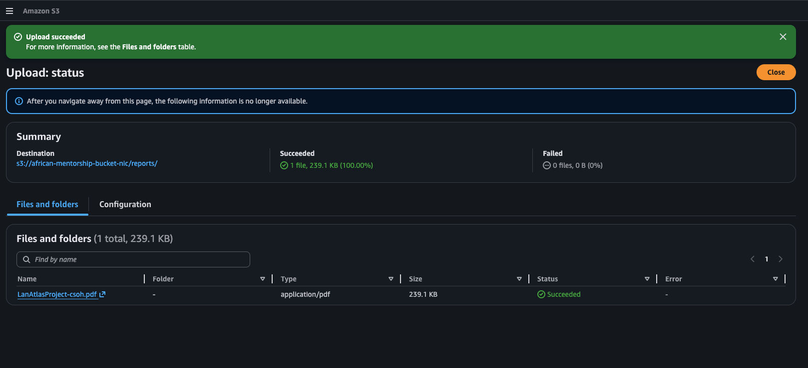
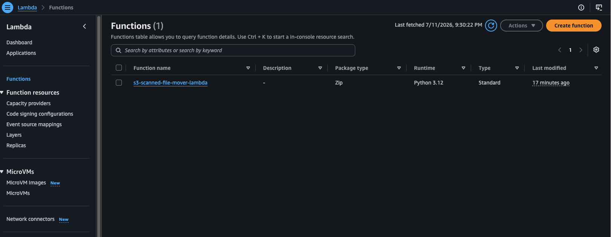
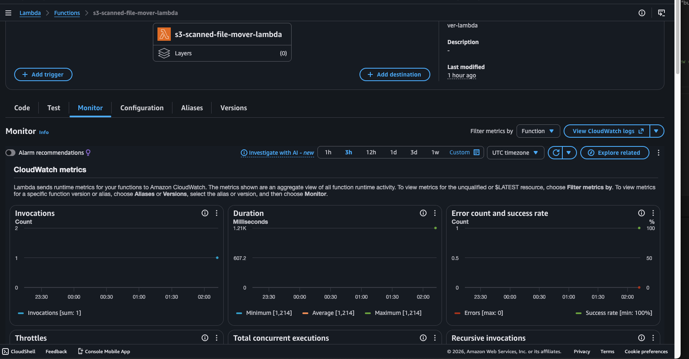
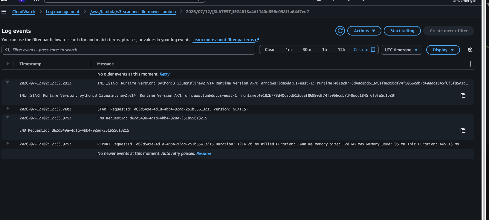
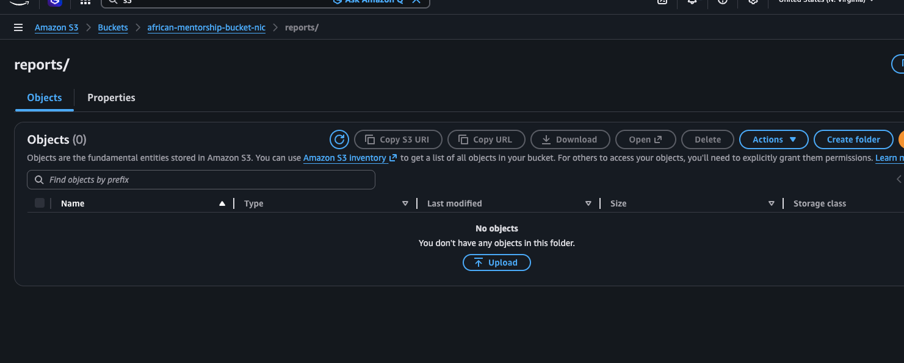
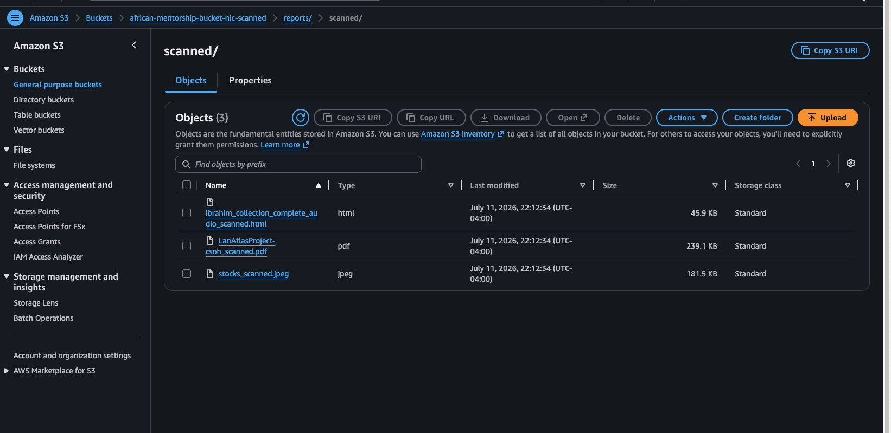
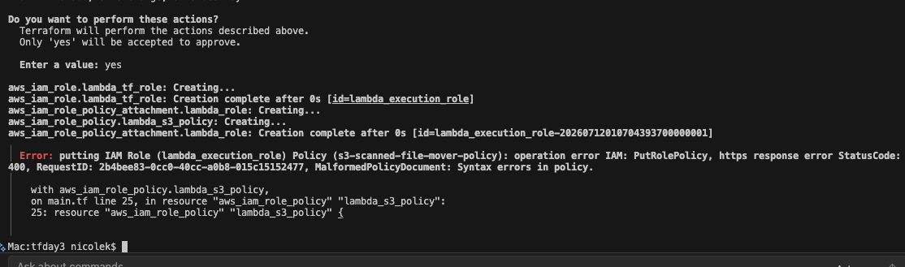
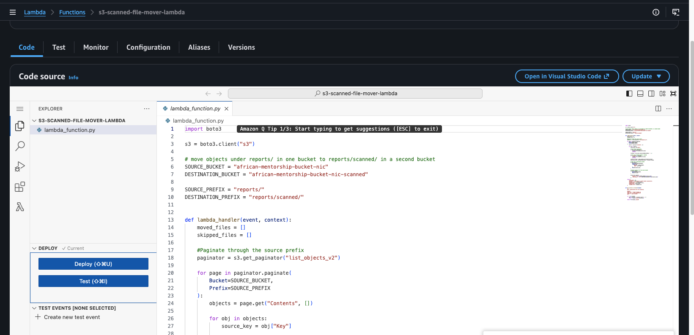

# S3 Scanned File Mover Lambda
This Terraform configuration deploys an AWS Lambda function that automatically moves and processes files from a source S3 bucket to a destination bucket, marking them as scanned in the process.
## Overview
The Lambda function performs the following operations:
1. **Read** files from a source S3 bucket (`african-mentorship-bucket-nic/reports/`)
2. **Copy** files to a destination S3 bucket (`african-mentorship-bucket-nic-scanned/reports/scanned/`)
3. **Rename** files by appending `_scanned` before the file extension (e.g., `report.pdf` → `report_scanned.pdf`)
4. **Delete** the original file from the source bucket
5. **Return** a summary of moved and skipped files
## Architecture
### AWS Components
- **Lambda Function**: `s3-scanned-file-mover`
  - Runtime: Python 3.12
  - Memory: 128 MB
  - Timeout: 60 seconds
  
- **IAM Role**: `s3-scanned-file-mover-lambda-role`
  - Allows Lambda to assume the role
  - Attached to Lambda basic execution policy for CloudWatch logs
- **IAM Policy**: `s3-scanned-file-mover-policy`
  - Permissions to list, read, and delete from source bucket
  - Permissions to write to destination bucket
### S3 Buckets
| Bucket | Purpose |
|--------|---------|
| `african-mentorship-bucket-nic` | Source bucket containing files to be scanned |
| `african-mentorship-bucket-nic-scanned` | Destination bucket for processed files |
### File Naming Convention
The Lambda function automatically renames files using this pattern:
- `report.pdf` → `report_scanned.pdf`
- `data.csv` → `data_scanned.csv`
- `document` → `document_scanned`
Files already containing `_scanned` in their filename are skipped to prevent duplicate processing.
## Prerequisites
- AWS Account with appropriate permissions
- Terraform >= 1.0
- AWS CLI configured with credentials

## Deployment
1. **Initialize Terraform**:
   ```bash
   terraform init
   ```
2. **Review Changes**:
   ```bash
   terraform plan
   ```
3. **Apply Configuration**:
   ```bash
   terraform apply
   ```

## Skipping Logic
The Lambda function skips files in the following cases:
1. **Folder placeholders**: Files ending with `/`
2. **Already scanned**: Files with `_scanned` in the filename
## State Management

Terraform state is stored in an S3 backend:
- **Bucket**: `mentorship-state-nic`
- **Key**: `terraform/terraform.tfstate`
- **Region**: `us-east-1`
- **Encryption**: Enabled
- **Lock File**: Enabled
## File Structure
```
.
├── main.tf              # Lambda function and IAM resources
├── providers.tf         # AWS provider configuration
├── variable.tf          # Variable definitions
├── terraform.tfvars     # Variable values
├── README.md            # This file
└── lambda/
    └── lambda_function.py  # Lambda handler code
```
## View of Deployed Code in AWS Console

### Source Bucket
Shows the source bucket before Lambda processing.



### Triggered Lambda Invocation
Lambda function triggered by an S3 `ObjectCreated` event.



### Lambda Function Invocation Logs
CloudWatch invocation details for the Lambda function.



### View of Logs
CloudWatch log output showing execution details.



### View of Source Bucket (Post-Processing)
Source bucket after the Lambda moved/processed the file.



### View of Destination Bucket
Destination bucket showing the scanned/renamed file.



### Sample Error
Example error encountered during development/debugging.



### View Lambda Configuration
Lambda function configuration in the AWS Console.



## Cleanup
To remove all resources created by this configuration:
```bash
terraform destroy
```
## Notes
- The Lambda function processes all files in the source prefix synchronously
- Large batches of files may exceed the 60-second timeout; consider adjusting the timeout value in `main.tf` if needed
- The function uses S3 pagination to handle large lists of files
- CloudWatch logs are available under `/aws/lambda/s3-scanned-file-mover`
